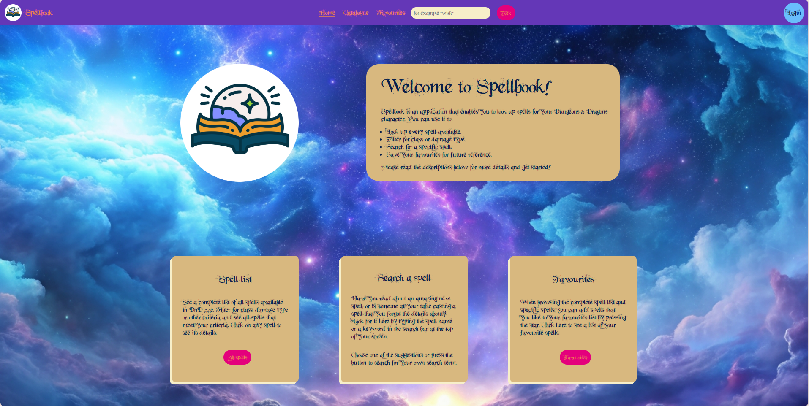

# Spellbook

In deze projectmap vind je de broncode van de Spellbook applicatie, een applicatie die het mogelijk maakt om alle spells
in de Dungeons & Dragons SRD, het gratis gepubliceerde deel van Dungeons & Dragons, te sorteren, te filteren en meer. Op
een rij biedt Spellbook de mogelijkheid aan ingelogde gebruikers om:

- Alle beschikbare spells te zien in een lijst
- Te filteren op verschillende attributen
- De lijst te sorteren op verschillende attributen
- Te zoeken naar een specifieke spell of een zoekterm
- Spells op te slaan als favoriet.

## Hoe ga je te werk

Om de applicatie te kunnen runnen, is een Integrated Development Environment (IDE) nodig, zoals Webstorm of VS Code.
Daarnaast is een API key nodig om nieuwe gebruikers aan te maken. De API key staat hieronder. Tenslotte heb je een apparaat nodig met een schermbreedte van tenminste 1024px.

Om de applicatie te kunnen runnen doe je als volgt:

- Clone de code naar je computer of download het en open in je IDE. In de terminal typ je het volgende command: <code> npm i (of npm install)</code>.
- Maak een .env bestand aan in de root map en plaats de API key hierin met de key VITE_API_KEY: <code>VITE_API_KEY=spellbook:DWq5bKoxCN1YisrFV1Jc</code>.
- Vervolgens typ je in de terminal <code>npm run build</code>. 
- Deze mag je weer stoppen door de toetsencombinatie CTRL + C te gebruiken
- Start hierna de applicatie door in de terminal <code>npm run dev</code> te typen. De applicatie opent zich dan op localhost:5173 (of een andere als deze al bezet is, de terminal laat het webadres zien.) Klik op de link in de terminal.

De applicatie opent zich op de homepagina. Met de blauwe knop in de navigatiebalk kan er genavigeerd worden naar de
inlogpagina. Hier kan je een account registreren (hiervoor is de API-key nodig). Mocht dit niet werken, gebruik dan de
testaccount om in te loggen:

Username: SpellbookTest 
 Password: Test1248

Veel plezier met het gebruik van Spellbook!